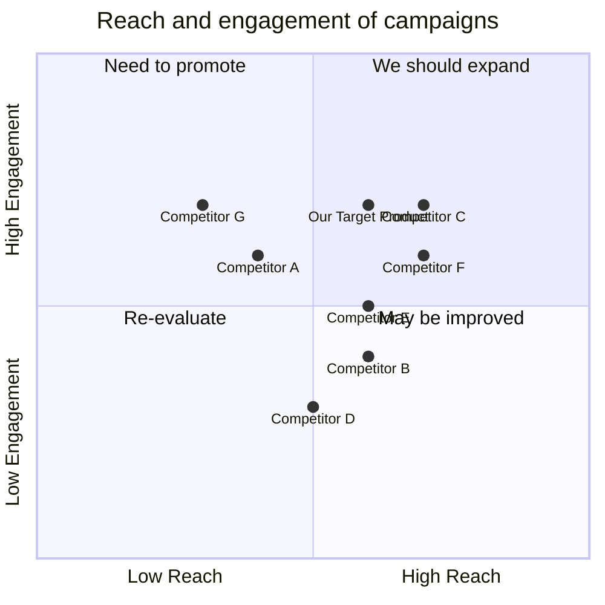

## Original Requirements:

[BOSS: Design a state-of-the-art patient scheduling system that integrates seamlessly with modern communication technologies to enhance the experience of patients and healthcare providers alike. The system should have the following features:

Automated Calling and Texting:

Upon identifying an available slot, the system should automatically reach out to the patient via both call and text to offer them the slot.
The patient should have the ability to confirm, reschedule, or decline the appointment through either the call or the text interface.
In the event of a declined slot or non-response within a stipulated time frame, the system should reach out to the next patient in line.
Intelligent Slot Allocation:

The system should have the capability to prioritize patients based on urgency, historical no-shows, and other relevant parameters.
It should be able to identify peak times and days and suggest off-peak slots to patients who have flexible schedules.
Automated Reminders:

As the appointment date approaches, the system should send out automated reminders via call and text to the patient. This will ensure that patients don’t forget their appointments, thereby reducing no-show rates.
Customizable reminder timings: Allow healthcare providers to set up how many days or hours in advance the reminders should be sent out.
Full Automation:

The entire process from slot identification to confirmation should be automated. Healthcare providers should only need to update slot availabilities and patient priorities.
The system should be capable of self-learning, identifying patterns in patient behavior and responses, and adapting its communication strategy accordingly.
Integration and Security:

The system should seamlessly integrate with existing Electronic Health Record (EHR) systems and adhere to healthcare security standards.
Patient data privacy should be a top priority. All communications should be encrypted, and no patient data should be stored without necessary encryption and protection.
Consider this system as a game-changer in healthcare scheduling, drastically reducing administrative overheads, enhancing patient experience, and ensuring that critical healthcare slots are utilized effectively. ]

## Product Goals:
```python
[
    "Enhance patient experience by automating the scheduling process",
    "Reduce administrative overheads for healthcare providers",
    "Ensure efficient utilization of critical healthcare slots"
]
```

## User Stories:
```python
[
    "As a patient, I want to receive automated calls and texts for available appointment slots, so that I can easily confirm, reschedule, or decline the appointment.",
    "As a patient, I want to receive automated reminders via call and text as the appointment date approaches, so that I don't forget my appointments.",
    "As a healthcare provider, I want the system to prioritize patients based on urgency and historical no-shows, so that critical cases are given priority.",
    "As a healthcare provider, I want the system to suggest off-peak slots to patients with flexible schedules, so that peak times can be utilized effectively.",
    "As a healthcare provider, I want the system to seamlessly integrate with existing Electronic Health Record (EHR) systems and adhere to healthcare security standards, so that patient data is protected."
]
```

## Competitive Analysis:
```python
[
    "Competitor A: Offers automated calling and texting for appointment scheduling, but lacks intelligent slot allocation and customizable reminder timings.",
    "Competitor B: Provides intelligent slot allocation and customizable reminder timings, but lacks seamless integration with EHR systems.",
    "Competitor C: Offers full automation and seamless integration with EHR systems, but lacks the ability to prioritize patients based on urgency and historical no-shows.",
    "Competitor D: Provides all the required features, but has a complex user interface and lacks self-learning capabilities.",
    "Competitor E: Offers self-learning capabilities and efficient slot utilization, but lacks seamless integration with EHR systems.",
    "Competitor F: Provides seamless integration with EHR systems and prioritization based on urgency and historical no-shows, but lacks automated reminders.",
    "Competitor G: Offers all the required features, but has a high cost and requires extensive customization."
]
```

## Competitive Quadrant Chart:


## Requirement Analysis:
The product should be a state-of-the-art patient scheduling system that integrates seamlessly with modern communication technologies. It should automate the scheduling process by offering automated calling and texting to patients for available appointment slots. Patients should have the ability to confirm, reschedule, or decline appointments through the call or text interface. The system should prioritize patients based on urgency, historical no-shows, and other relevant parameters. It should also identify peak times and suggest off-peak slots to patients with flexible schedules. The system should send automated reminders via call and text as the appointment date approaches, with customizable reminder timings. The entire process from slot identification to confirmation should be automated, with healthcare providers only needing to update slot availabilities and patient priorities. The system should be capable of self-learning, identifying patterns in patient behavior and responses, and adapting its communication strategy accordingly. It should seamlessly integrate with existing Electronic Health Record (EHR) systems and adhere to healthcare security standards, ensuring patient data privacy.

## Requirement Pool:
```python
[
    ("Automated calling and texting for appointment scheduling", "P0"),
    ("Automated reminders via call and text", "P0"),
    ("Intelligent slot allocation based on urgency and historical no-shows", "P0"),
    ("Suggest off-peak slots to patients with flexible schedules", "P1"),
    ("Seamless integration with EHR systems", "P1")
]
```

## UI Design draft:
The user interface should have a simple and intuitive design. It should display available appointment slots and allow patients to easily confirm, reschedule, or decline appointments. The interface should also provide options for healthcare providers to update slot availabilities and patient priorities. The design should be responsive and accessible on both desktop and mobile devices. The layout should be clean and organized, with clear labels and buttons for each action. The style should be professional and consistent with healthcare industry standards.

## Anything UNCLEAR:
There are no unclear points.