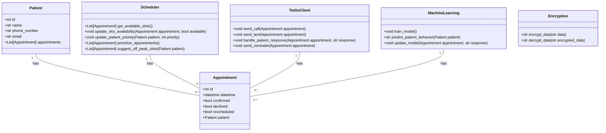
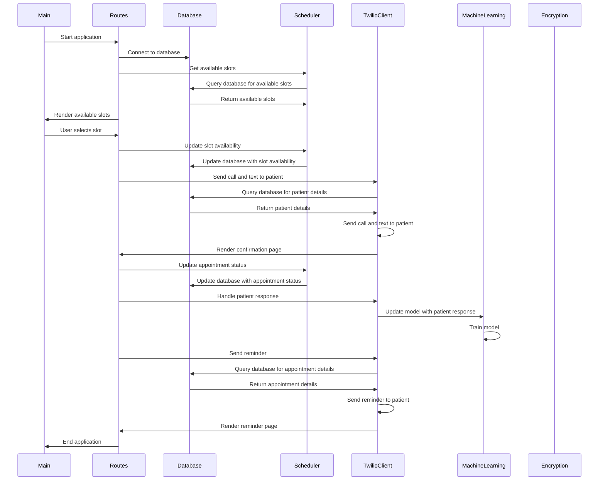

## Implementation approach:
To design a state-of-the-art patient scheduling system, we will use the following open-source tools:

1. Flask: Flask is a micro web framework for Python that allows us to build web applications quickly and easily. We will use Flask to create the backend of our system and handle the communication between the frontend and the database.

2. SQLAlchemy: SQLAlchemy is a SQL toolkit and Object-Relational Mapping (ORM) library for Python. We will use SQLAlchemy to interact with the database and perform CRUD operations on patient and appointment data.

3. Twilio: Twilio is a cloud communications platform that provides APIs for sending and receiving SMS and voice calls. We will use Twilio to automate the calling and texting functionality of our system, including sending appointment offers, reminders, and handling patient responses.

4. Scikit-learn: Scikit-learn is a machine learning library for Python. We will use Scikit-learn to implement the self-learning capabilities of our system, including identifying patterns in patient behavior and responses, and adapting the communication strategy accordingly.

5. PyCryptodome: PyCryptodome is a Python library that provides cryptographic functions. We will use PyCryptodome to encrypt and decrypt patient data, ensuring data privacy and security.

## Python package name:
```python
"patient_scheduling_system"
```

## File list:
```python
[
    "main.py",
    "models.py",
    "routes.py",
    "database.py",
    "scheduler.py",
    "twilio_client.py",
    "machine_learning.py",
    "encryption.py"
]
```

## Data structures and interface definitions:


## Program call flow:


## Anything UNCLEAR:
The requirements are clear and there are no unclear points.